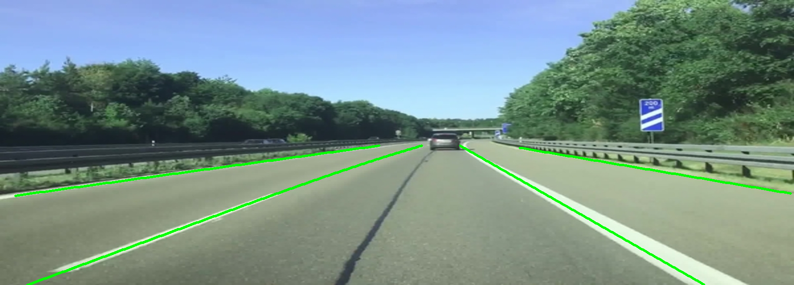
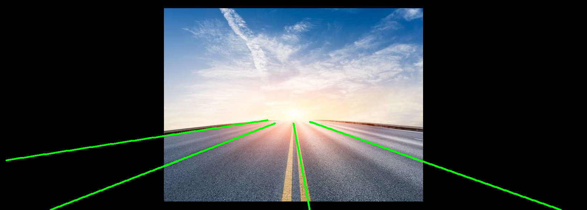
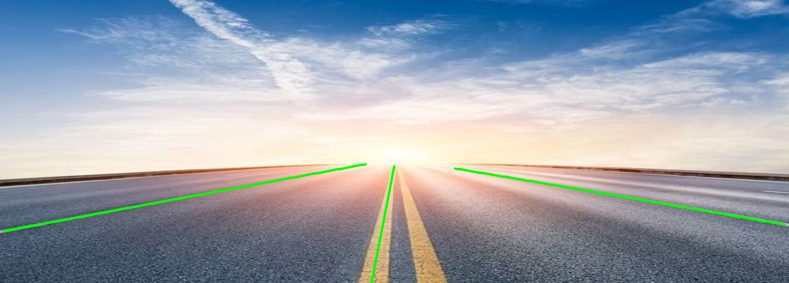
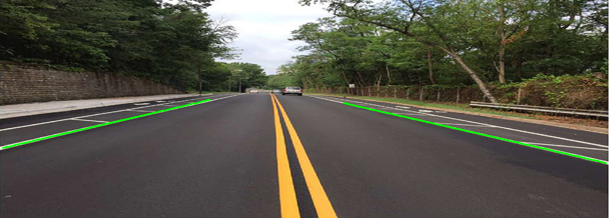

# Image-Based Vehicle Lane-Change Detection

Research internship project — **Multimedia Lab, Yuan Ze University, Taiwan**
Supervisor: Prof. Duan-Yu Chen · Jun – Aug 2025
Author: Nutt Bhanidch (KMUTT, Electronics & Infocommunication Engineering)

Detecting *"that car just changed lanes"* from ordinary road video needs two facts at the
same time — **where the lanes are** and **where the cars are** — and they come from two
different models whose outputs disagree frame to frame. This repo is the pipeline that
reconciles them.

📄 **[Final presentation (PDF)](docs/internship-presentation.pdf)** ·
🎬 **[Demo clip](results/lane_change_demo.mp4)**

---

## ⚠️ What is mine and what is not — read this first

This repo contains a **vendored copy of someone else's research code**. Being clear about
which is which matters more than looking impressive:

| Path | Whose | What |
|---|---|---|
| `notebooks/` | **mine** | The integrated pipeline, the lane-change rule, `HomemadeStrongSORT` |
| `third_party/CLRerNet/demo/video_demo.py` | **mine** | Runs CLRerNet over a video file, with CLAHE pre-processing |
| `clrnet_legacy/` | **mine** | Earlier video runner written against the older CLRNet |
| `results/`, `docs/` | **mine** | Output frames, demo clip, the presentation |
| `third_party/CLRerNet/` (everything else) | **NOT mine** | [hirotomusiker/CLRerNet](https://github.com/hirotomusiker/CLRerNet), WACV 2024, Apache 2.0 — unmodified |

To be exact: `git diff` between `third_party/CLRerNet/` and upstream `main` is
**one new file, 186 lines** — `demo/video_demo.py`. Nothing else was touched.

> This vendored copy replaces the separate `CLRerNet_with_video_demo` fork, which can now
> be deleted. Vendoring pins a version known to work with the rest of the pipeline instead
> of depending on upstream staying compatible.

---

## Pipeline

```
                ┌── CLRerNet ─────────────► lane boundaries (ordered point sequences)
                │                                          │
camera video ───┤                                          ├──► lane-change rule ──► event
                │                                          │      (temporal
                └── YOLOv11-s + tracker ──► vehicle boxes ─┘       consistency)
                                            + stable IDs
```

| Stage | Model | What it produces |
|---|---|---|
| Lane detection | CLRerNet (DLA-34, CULane) | lane lines as ordered point sequences, drawn as continuous polylines |
| Vehicle detection | YOLOv11-s | boxes + class + confidence for cars, trucks, buses, motorcycles |
| Tracking | `HomemadeStrongSORT` — written from scratch here | one stable ID per vehicle across frames |
| Decision | custom rule | each vehicle's **bottom edge** is tracked; when it crosses a lane boundary **consistently over multiple frames**, a lane change is flagged |

The last row is the part that matters. A single-frame crossing test produces a storm of
false positives — jitter in either model is enough to trip it. Requiring the crossing to
hold across consecutive frames is what makes the output usable.

### Why a hand-written tracker

`HomemadeStrongSORT` is a from-scratch centroid + IoU association tracker with a
disappearance counter, not a wrapper around a library. It was written this way to keep the
association logic inspectable while debugging why IDs were swapping between adjacent
vehicles — which turned out to be the root cause of most early false lane-change events.

---

## Installation

There are **two separate environments** here. They cannot share one, and trying to make
them share one is how a week disappears.

### A. CLRerNet — lane detection

Pinned versions taken from upstream's Docker build. **Every one of these matters**; mmcv in
particular is compiled against a specific torch/CUDA pair and fails at import if the
combination is off.

| | version |
|---|---|
| Python | 3.11.9 |
| PyTorch | 2.1.0 (cu121) |
| torchvision | 0.16.0 |
| openmim | 0.3.9 |
| mmcv | 2.1.0 |
| mmengine | 0.10.5 |
| mmdet | 3.3.0 |
| numpy | **< 2.0** |

**Docker is strongly recommended** — it is what upstream tests against, and it builds the
CUDA lane-NMS extension for you:

```bash
cd third_party/CLRerNet
docker compose build --build-arg UID="`id -u`" dev
docker compose run --rm dev
```

<details>
<summary>Manual install (Linux + NVIDIA GPU), if you cannot use Docker</summary>

```bash
cd third_party/CLRerNet
conda create -n clrernet python=3.11.9 -y && conda activate clrernet

pip install "numpy<2.0"
pip install torch==2.1.0 --index-url https://download.pytorch.org/whl/cu121
pip install torchvision==0.16.0

pip install -U openmim==0.3.9
mim install mmcv==2.1.0
mim install mmengine==0.10.5
mim install mmdet==3.3.0

pip install -r requirements.txt
pip install "numpy<2.0"          # some of the above quietly pull numpy 2.x back in

# CUDA lane-NMS extension — needs nvcc and a GPU present at build time
cd libs/models/layers/nms && python setup.py install && cd ../../../..

export PYTHONPATH=$PYTHONPATH:$(pwd)
export CUBLAS_WORKSPACE_CONFIG=:4096:8    # deterministic training
```

The two things that go wrong most often:

1. **`pip install mmcv` instead of `mim install mmcv`.** `mim` picks the prebuilt wheel
   matching your torch/CUDA; plain pip builds from source and usually fails — or succeeds
   and then segfaults at import.
2. **numpy 2.x creeping back in.** Several packages pull it in after you pin it. Re-pin
   last, then check: `python -c "import numpy; print(numpy.__version__)"`.

</details>

**Weights** (not in this repo — 140 MB, over GitHub's file size limit):

```bash
wget https://github.com/hirotomusiker/CLRerNet/releases/download/v0.1.0/clrernet_culane_dla34_ema.pth
```

### B. The notebooks — YOLO detection + tracking

Much simpler, and runs on CPU if you are patient:

```bash
conda create -n lanechange python=3.11 -y && conda activate lanechange
pip install ultralytics opencv-python numpy tqdm
pip install torch torchvision      # add --index-url https://download.pytorch.org/whl/cu121 for GPU
jupyter notebook notebooks/lane_change_detection.ipynb
```

`ultralytics` downloads the YOLOv11 weights on first run. The RAFT optical-flow
experiments in `yolo_homemade_tracker_experimental.ipynb` use
`torchvision.models.optical_flow`, which is already included.

### C. `clrnet_legacy/` — will not build today

Written against the original CLRNet (`torch==1.8.0`, `mmcv==1.2.5`) on the lab's DGX
machine. Those versions predate current CUDA toolkits and no longer install cleanly. Kept
for the record, not to be run — use CLRerNet instead.

---

## Running it

**Lane detection over a video** — this is the file I wrote:

```bash
cd third_party/CLRerNet
python demo/video_demo.py \
    /path/to/input.mp4 \
    configs/clrernet/culane/clrernet_culane_dla34_ema.py \
    clrernet_culane_dla34_ema.pth \
    --out-file=result.mp4
```

Per frame: CLAHE contrast enhancement on the L channel in LAB space → resize to the model's
1640×590 input → inference → draw lanes → resize back to source resolution → write. CLAHE
is there because the lab footage was shot in harsh daylight and lane markings washed out in
the bright patches.

**Single image** (upstream's script, unmodified):

```bash
python demo/image_demo.py demo/demo.jpg \
    configs/clrernet/culane/clrernet_culane_dla34_ema.py \
    clrernet_culane_dla34_ema.pth --out-file=result.png
```

**The full pipeline** — `notebooks/lane_change_detection.ipynb`.

> **Note on the output codec:** `cv2.VideoWriter` with `'mp4v'` writes MPEG-4 Part 2, which
> **browsers cannot play**. Convert before sharing anywhere on the web:
> ```bash
> ffmpeg -i result.mp4 -c:v libx264 -crf 23 -movflags +faststart web.mp4
> ```

---

## Results

| | |
|---|---|
|  |  |
| Lane detection alone | Lanes + vehicles + IDs |
|  |  |
| Integrated system | Run on footage shot by hand, not from the dataset |

More in [`results/`](results/).

---

## Honest limitations

1. **No quantitative benchmark.** The deliverable was a working end-to-end pipeline
   demonstrated on video, not a number on a public benchmark. There is no mAP or
   lane-change F1 to quote, and this README is not going to invent one.
2. **Tuned on a small set of clips.** The temporal-consistency thresholds were set by
   watching failures on the clips available in the lab, not by a search over a held-out
   set. Expect them to need retuning on different camera heights and frame rates.
3. **Daytime, clear-weather footage only.** Nothing here was tested at night or in rain.
4. **The tracker is a teaching-grade StrongSORT**, not the published one — no appearance
   embeddings, no Kalman filter. It holds IDs well enough for this task and no further.
5. **`video_demo.py` writes each frame to a temp PNG** before inference, because
   `inference_one_image` takes a file path. That is a disk round-trip per frame and is the
   main reason it is slow. Passing the array straight through would be the obvious fix.

---

## References

The lane detection model, and the line of work it comes from:

```BibTeX
@inproceedings{honda2024clrernet,
  title={Clrernet: improving confidence of lane detection with laneiou},
  author={Honda, Hiroto and Uchida, Yusuke},
  booktitle={Proceedings of the IEEE/CVF winter conference on applications of computer vision},
  pages={1176--1185},
  year={2024}
}
```

- **CLRerNet** — [hirotomusiker/CLRerNet](https://github.com/hirotomusiker/CLRerNet) ·
  [paper (WACV 2024)](https://openaccess.thecvf.com/content/WACV2024/html/Honda_CLRerNet_Improving_Confidence_of_Lane_Detection_With_LaneIoU_WACV_2024_paper.html) · Apache 2.0
- **CLRNet** — [Turoad/CLRNet](https://github.com/Turoad/CLRNet/), the baseline CLRerNet builds on
- **LaneATT** — [lucastabelini/LaneATT](https://github.com/lucastabelini/LaneATT)
- **Conditional Lane Detection** — [aliyun/conditional-lane-detection](https://github.com/aliyun/conditional-lane-detection)
- **CULane dataset** — [project page](https://xingangpan.github.io/projects/CULane.html), source of the pre-trained lane weights
- **mmdetection** — [open-mmlab/mmdetection](https://github.com/open-mmlab/mmdetection) · **mmcv** — [open-mmlab/mmcv](https://github.com/open-mmlab/mmcv)
- **YOLOv11 / Ultralytics** — [ultralytics/ultralytics](https://github.com/ultralytics/ultralytics) · AGPL-3.0
- **StrongSORT** — Du et al., *StrongSORT: Make DeepSORT Great Again*, IEEE TMM 2023 — the
  design `HomemadeStrongSORT` is loosely modelled on, not a port of

`demo/video_demo.py` is adapted from mmdetection's `demo/image_demo.py` (Apache 2.0); the
header of the file says so.

---

## License

[Apache License 2.0](LICENSE) — see [NOTICE](NOTICE) for third-party attributions.

Apache 2.0 matches CLRerNet, which is vendored here under `third_party/`. Note that
YOLOv11 is **AGPL-3.0**, which is strong copyleft: if you deploy a network service built on
it, that obligation reaches your own source too. Listed here so nobody is surprised by it
later.
